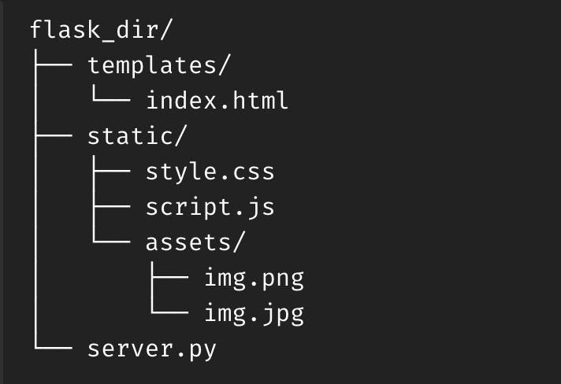

# Flask App Checklist
## Flask App Folder Tree Diagram


## Making the Root folder
#### In terminal - run:

```
mkdir flask_dir
cd flask_dir
```

```
mkdir templates
cd templates
touch index.html
cd ..
```

```
mkdir static
cd static
touch style.css
touch script.js
cd ..
```

```
pipenv install flask
```

```
touch server.py
```

## Paste into server.py:
- <em> SEE PYTHON FILE IN REPO FOR DOCUMENT TEMPLATE </em>
- <em> SEE JSON FILE FOR SNIPPET </em>
```
User Snippet: servflask
```

## Paste into index.html:
- <em> SEE PYTHON FILE IN REPO FOR DOCUMENT TEMPLATE </em>
- <em> SEE JSON FILE FOR SNIPPET </em>
```
User Snippet: bootshtml
```
#### If using User Snippet, proceed here:
<em>In HEAD section and before TITLE:</em>

```
<!-- linking a javascript file -->
<script type="text/javascript" src="{{ url_for('static', filename='my_script.js') }}"></script>
<!-- linking an image -->

<!-- linking a css style sheet -->
<link rel="stylesheet" type="text/css" href="{{ url_for('static', filename='my_style.css') }}">
```

## Initiating the server
#### In terminal - run:
```
python3 server.py (MAC)
```

<em>To view in Browser:</em>
```
Head to http://localhost:5000/ (bookmark) include root slash if specified
```
## To exit Virtual Environment
#### In terminal - run:
```
CTRL + C (MAC)
```
